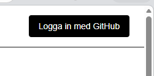
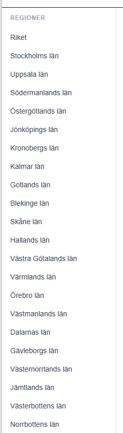
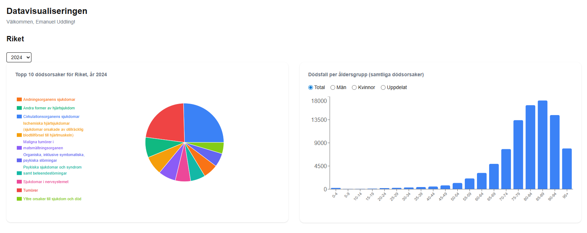
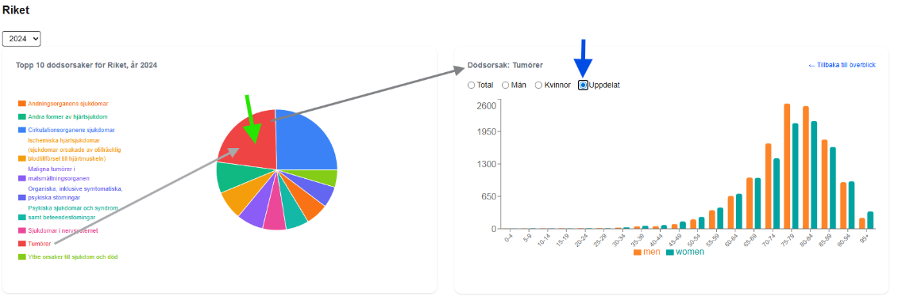

# Assignment WT - Web for Data Science

## Project Name

Swedish Death Records Dashboard

## Objective

> Create a functional, visually engaging, and *interactive* data visualization web application that consumes the API you built in the previous assignment. The application must authenticate users via OAuth and be publicly accessible.

An interactive data visualization dashboard for Swedish mortality data published
by Socialstyrelsen — 7.2 million records spanning 1997–2024.

Users select a region and a year (defaulting to 2024) to explore two linked
charts: a Pie chart showing the top 10 most common causes of death in that
region, and a Bar chart breaking down deaths by age group. Clicking a cause in
the Pie chart filters the Bar chart to show the age-group distribution for that
specific cause, with a reset to return to the all-causes view.

## Deployed Application

> *Provide the link to your publicly accessible application:*

> URL: https://wt.emanuelapps.duckdns.org/dashboard

## Requirements

See [all requirements in Issues](../../issues/). Close issues as you implement them. Create additional issues for any custom functionality.

### Functional Requirements

| Requirement | Issue | Status |
|---|---|---|
| API Integration — the app consumes your WT1 API | [#14](../../issues/14) | ✅ |
| OAuth Authentication — users log in via OAuth 2.0 | [#15](../../issues/15) | ✅ |
| Interactive data visualization with aggregation/adaptation for 10 000+ data points | [#11](../../issues/11) | ✅ |
| Efficient loading — pagination, lazy loading, loading indicators | [#13](../../issues/13) | ✅|

### Non-Functional Requirements

| Requirement | Issue | Status |
|---|---|---|
| Clear and well-structured code | [#1](../../issues/1) | ✅ |
| Code reuse | [#2](../../issues/2) | ✅ |
| Dependency management and scripts | [#3](../../issues/3) | ✅ |
| Source code documentation | [#4](../../issues/4) | ✅ |
| Coding standard | [#5](../../issues/5) | ✅ |
| Examiner can follow the creation process | [#6](../../issues/6) | ✅ |
| Publicly accessible over the internet | [#7](../../issues/7) | ✅ |
| Keys and tokens handled correctly | [#8](../../issues/8) | ✅ |
| Complete assignment report with correct links | [#9](../../issues/9) | ✅ |

### VG — AI/ML Feature (optional)

For a VG grade, integrate **one** AI/ML feature into the application. Pick one below or propose your own of similar scope. See the [VG issue](../../issues/12) for full details and acceptance criteria.

| Option | Status |
|---|---|
| Semantic Search — natural language queries matched by meaning | TODO |
| Content-Based Recommendations — "items similar to this one" | :white_large_square: |
| Sentiment Analysis — analyze and visualize text sentiment | :white_large_square: |
| Text Summarization / Generation — LLM-powered summaries | :white_large_square: |
| Clustering & Grouping — auto-group similar items visually | :white_large_square: |
| RAG — natural language Q&A grounded in your dataset | TODO |
| Other: *describe* | :white_large_square: |

*Describe your chosen AI/ML feature and how it integrates with your application:*

## Core Technologies Used

| Layer | Technology | Why |
|---|---|---|
| **Visualization** | Recharts  | React-native charting with straightforward Pie + Bar support and easy drill-down interactivity |
| **Front-end** | React, Next.js | SSR, API routes, and NextAuth all in one framework |
| **Styling** | Tailwind CSS | Utility-first styling with no component library overhead |
| **Auth** | NextAuth.js (OAuth 2.0) | Straightforward OAuth integration with built-in session management |

## Environment variables (`.env.local`)

| Variable | Description |
|---|---|
| `NEXTAUTH_URL` | Public URL of the Next.js app |
| `NEXTAUTH_SECRET` | Random secret for session encryption |
| `GITHUB_ID` | OAuth provider client (GitHub) ID |
| `GITHUB_SECRET` | OAuth provider client (GitHub) secret |
| `GOOGLE_ID` | OAuth provider client (Google) ID |
| `GOOGLE_SECRET` | OAuth provider client (Google) secret |
| `API_BASE_URL` | Internal URL of the WT1 API |
| `INTERNAL_SECRET` | Internal secret to verify the comunication from WT to API is not tempered with |

## How to Use

*Explain how to interact with your visualization (controls, filters, etc.). Screenshots/gifs are encouraged.*
#### Quick-guide:
1. Visit <https://wt.emanuelapps.duckdns.org> and log in with your OAuth account.
2. Select a **region** from the dropdown. The year defaults to **2024** but can
   be changed with the year picker.
3. Two charts load automatically:
   - **Pie chart** — top 10 causes of death in the selected region/year.
   - **Bar chart** — age-group distribution for all causes combined.
4. Click any slice in the Pie chart to filter the Bar chart to that specific
   cause. A **"Back to all causes"** button resets the view.
5. And/or click on the bar chart to filter by sexes.

#### In detail guide:

Log in with GitHub (Google later)

Select region from list to the left.

Select from:
Year: (2024 set to default, but 1997-2024 available)
or dive in by interacting with the charts:
Click a slice from the pie chart or sort the bar chart by wished filter.

By clicking on the red slice "Tumörer" the bar chart is updated to show data related. 
By also apply the "Uppdelat" the bar chart show how the deaths from men and women differs among the age groups.

## Acknowledgements

*Resources, attributions, or shoutouts.*
- Mortality dataset: [Socialstyrelsen](https://www.socialstyrelsen.se/)

